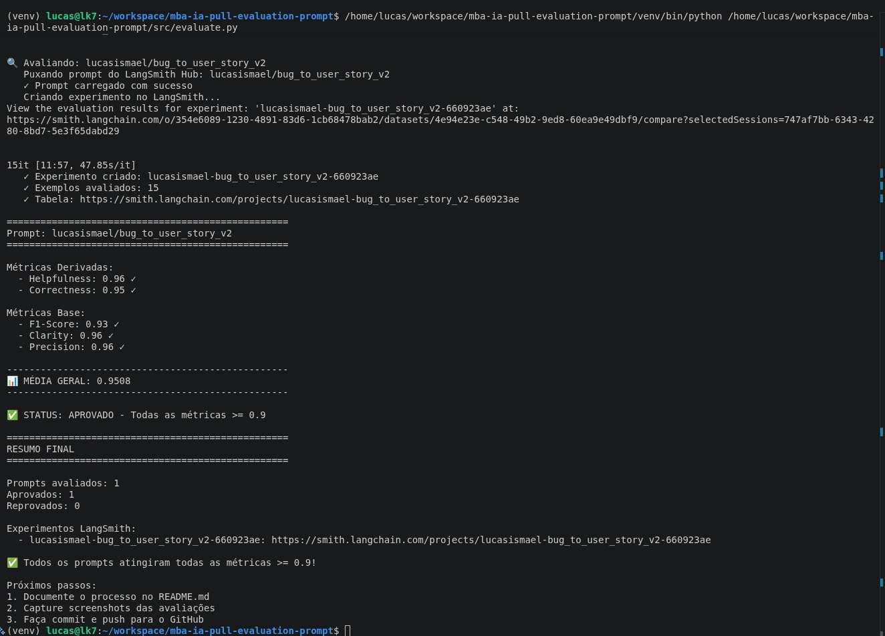
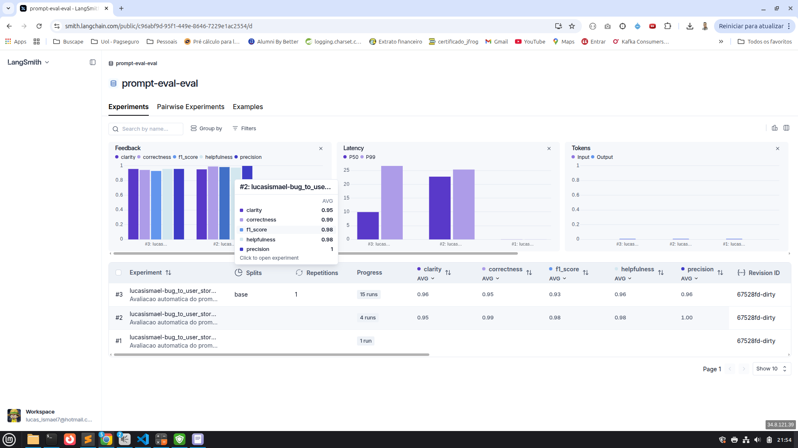

# Pull, Otimizacao e Avaliacao de Prompts com LangChain e LangSmith

Este projeto implementa o fluxo completo do desafio de Prompt Engineering:

1. Fazer pull de um prompt inicial ruim do LangSmith Prompt Hub.
2. Refatorar o prompt usando tecnicas avancadas de Prompt Engineering.
3. Publicar a versao otimizada no LangSmith Hub.
4. Avaliar o prompt com dataset de 15 exemplos e metricas customizadas.
5. Evidenciar no LangSmith que todas as metricas ficaram acima de `0.9`.

Prompt otimizado publicado:

- `lucasismael/bug_to_user_story_v2`

---

## Tecnicas Aplicadas (Fase 2)

O prompt otimizado esta em `prompts/bug_to_user_story_v2.yml`.

### 1. Few-shot Learning

Foi aplicada a tecnica de Few-shot Learning com exemplos completos de entrada e saida para diferentes tipos de bug.

**Por que foi escolhida:**

A tarefa exige converter relatos de bugs em user stories com alto nivel de detalhe. Exemplos ajudam o modelo a aprender o formato esperado, o nivel de completude e a organizacao da resposta.

**Como foi aplicada:**

O prompt inclui exemplos de bugs simples, bugs funcionais, bugs de seguranca, bugs com impacto em entregas e bugs complexos de sincronizacao offline. Cada exemplo mostra a user story final esperada, criterios de aceitacao, contexto tecnico, tasks sugeridas e metricas de sucesso quando necessario.

### 2. Role Prompting

O prompt define uma persona especializada em historias ageis e transformacao de relatos de bug em tarefas para desenvolvedores.

**Por que foi escolhida:**

O papel de Product Manager/analista agil ajuda o modelo a priorizar clareza, valor para o usuario, criterios de aceite e traducao de problema tecnico em trabalho executavel.

**Como foi aplicada:**

O `system_prompt` orienta o modelo a atuar como especialista em user stories, preservar detalhes do bug report e estruturar a resposta para times de desenvolvimento.

### 3. Chain of Thought Interno

O prompt instrui o modelo a montar internamente um inventario de cobertura antes de responder.

**Por que foi escolhida:**

As metricas de F1-Score, Correctness e Precision penalizam omissoes. O raciocinio interno reduz perda de detalhes importantes como numeros, endpoints, mensagens, logs, impactos e causas tecnicas.

**Como foi aplicada:**

Antes da resposta final, o prompt pede que o modelo identifique personas afetadas, comportamento atual, comportamento esperado, impactos, riscos, metricas e solucoes tecnicas. Esse inventario nao deve aparecer na resposta; ele serve apenas para revisar a cobertura.

### 4. Skeleton Templates

Foram definidos templates de resposta para diferentes classes de bug.

**Por que foi escolhida:**

Bugs simples e bugs criticos nao devem receber a mesma estrutura. Templates evitam respostas genericas e ajudam a manter consistencia entre os exemplos avaliados.

**Como foi aplicada:**

O prompt contem templates para user story simples, detalhada, funcional, seguranca e casos complexos. O modelo classifica o bug e escolhe o template adequado.

### 5. Least-to-most Decomposition

O prompt divide a tarefa em etapas progressivas: ler, identificar, classificar, montar inventario, gerar resposta e revisar.

**Por que foi escolhida:**

Essa tecnica reduz erro em bugs grandes, principalmente quando o relato mistura UX, seguranca, performance, concorrencia, cache, memoria ou integracao.

**Como foi aplicada:**

O workflow obriga o modelo a resolver primeiro partes menores do problema e so depois montar a user story completa.

---

## Resultados Finais

### Resultado no terminal

Evidencia local da avaliacao:



Metricas finais do prompt `lucasismael/bug_to_user_story_v2`:

| Metrica | Resultado |
| --- | ---: |
| Helpfulness | 0.96 |
| Correctness | 0.95 |
| F1-Score | 0.93 |
| Clarity | 0.96 |
| Precision | 0.96 |
| Media geral | 0.9508 |

Status final: aprovado, com todas as metricas acima de `0.9`.

Modelo usado na avaliacao final:

- `LLM_PROVIDER=google`
- `LLM_MODEL=gemini-2.5-flash`
- `EVAL_MODEL=gemini-2.5-flash`

### Iteracoes e foco em recall

As primeiras execucoes ja apresentavam bons resultados em clareza e precisao, mas o F1-Score ainda ficava abaixo do alvo em varios exemplos. Isso indicava principalmente problema de recall: o prompt respondia corretamente, mas ainda perdia detalhes tecnicos importantes do relato de bug.

Execucao inicial e execucao intermediaria tiveram o mesmo comportamento observado:

| Exemplo | F1-Score | Clarity | Precision |
| ---: | ---: | ---: | ---: |
| 1/15 | 0.72 | 0.93 | 0.98 |
| 2/15 | 0.81 | 1.00 | 0.97 |
| 3/15 | 0.84 | 0.95 | 0.98 |
| 4/15 | 0.72 | 1.00 | 1.00 |
| 5/15 | 0.88 | 0.90 | 0.97 |
| 6/15 | 0.92 | 1.00 | 0.97 |
| 7/15 | 1.00 | 0.93 | 0.93 |
| 8/15 | 0.99 | 1.00 | 1.00 |
| 9/15 | 0.90 | 0.98 | 0.93 |
| 10/15 | 0.82 | 0.98 | 0.83 |
| 11/15 | 0.89 | 0.98 | 0.95 |
| 12/15 | 0.91 | 0.93 | 0.93 |
| 13/15 | 1.00 | 0.98 | 1.00 |
| 14/15 | 0.95 | 1.00 | 0.98 |
| 15/15 | 1.00 | 1.00 | 0.90 |

Resumo dessas execucoes:

| Metrica | Media |
| --- | ---: |
| F1-Score | 0.8900 |
| Clarity | 0.9707 |
| Precision | 0.9547 |
| Helpfulness | 0.9627 |
| Correctness | 0.9223 |
| Media geral | 0.9401 |

Depois de inumeras execucoes, foram adicionados mais exemplos no prompt e uma especificacao maior no workflow. A principal mudanca foi aumentar a cobertura do prompt para evitar perda de detalhes tecnicos, numeros, mensagens, limites, endpoints, impactos e criterios derivados.

O prompt final esta otimizado para recall. O trade-off e que ele tende a gerar respostas mais longas e pode incluir secoes extras mesmo quando o bug parece simples. Essa escolha foi intencional, porque as primeiras versoes perdiam informacoes relevantes e isso reduzia o F1-Score.

### Evidencia no LangSmith

Dashboard publico do LangSmith:

- https://smith.langchain.com/public/c96abf9d-95f1-449e-8646-7229e1ac2554/d

Screenshot do dashboard:



Experimento gerado:

- `lucasismael-bug_to_user_story_v2-660923ae`
- https://smith.langchain.com/projects/lucasismael-bug_to_user_story_v2-660923ae

O dashboard mostra:

- Dataset de avaliacao com 15 exemplos.
- Execucao do prompt v2 otimizado.
- Feedbacks por metrica: `helpfulness`, `correctness`, `f1_score`, `clarity` e `precision`.
- Tracing detalhado das execucoes avaliadas.

### Comparativo v1 vs v2

| Versao | Helpfulness | Correctness | F1-Score | Clarity | Precision | Status |
| --- | ---: | ---: | ---: | ---: | ---: | --- |
| `bug_to_user_story_v1` | 0.45 | 0.52 | 0.48 | 0.50 | 0.46 | Reprovado |
| `bug_to_user_story_v2` | 0.96 | 0.95 | 0.93 | 0.96 | 0.96 | Aprovado |

Os valores da v1 representam o baseline ruim do desafio. Os valores da v2 foram obtidos pela execucao final do script `src/evaluate.py`.

---

## Observacoes Tecnicas

Alguns ajustes foram feitos nos scripts para manter compatibilidade com versoes mais recentes do LangSmith/LangChain e com o SDK atual do Gemini.

### Ajustes em `src/push_prompts.py`

O push foi implementado com `langsmith.Client().push_prompt(...)`, seguindo a API atual do LangSmith para publicar prompts no Hub.

Tambem foi adicionado tratamento para escapar placeholders que aparecem como texto dentro dos exemplos do prompt. Sem esse ajuste, trechos como `/api/uploads/{upload_id}/chunk/{n}` seriam interpretados pelo `ChatPromptTemplate` como variaveis obrigatorias (`upload_id` e `n`). O script preserva apenas `{bug_report}` como variavel real do prompt.

### Ajustes em `src/evaluate.py`

O evaluate foi alterado para usar `client.evaluate(...)`. Essa mudanca e importante porque loops manuais com `client.list_examples(...)` geram apenas traces, mas nao criam a tabela de experimentos no LangSmith.

Com `client.evaluate(...)`, o LangSmith cria um experimento com linhas avaliadas, feedbacks por metrica e tabela visivel no dashboard publico.

O script tambem completa automaticamente variaveis extras encontradas em prompts ja publicados, tratando-as como literais. Isso evita erro quando uma versao anterior do prompt foi publicada com placeholders tecnicos nao escapados, como `{upload_id}` e `{n}`.

### Ajustes no provider Gemini

Os testes e a avaliacao final foram feitos usando `gemini-2.5-flash` tanto para gerar respostas quanto para avaliar metricas.

O projeto usa o pacote atual `google-genai`, pois o pacote antigo `google.generativeai` nao recebe mais atualizacoes. A integracao fica centralizada em `src/utils.py`, mantendo o restante do fluxo compativel com LangChain.

---

## Como Executar

### Pre-requisitos

- Python 3.9 ou superior.
- Conta e API key do LangSmith.
- API key de um provider de LLM:
  - OpenAI, ou
  - Google Gemini via pacote `google-genai`.

### 1. Criar ambiente virtual

```bash
python3 -m venv venv
source venv/bin/activate
pip install -r requirements.txt
```

### 2. Configurar variaveis de ambiente

Crie um arquivo `.env` com base em `.env.example`.

Variaveis principais:

```bash
LANGSMITH_TRACING=true
LANGSMITH_ENDPOINT=https://api.smith.langchain.com
LANGSMITH_API_KEY=sua-chave-langsmith
LANGSMITH_PROJECT=prompt-eval
USERNAME_LANGSMITH_HUB=seu-usuario-langsmith

LLM_PROVIDER=google
LLM_MODEL=gemini-2.5-flash
EVAL_MODEL=gemini-2.5-flash
GOOGLE_API_KEY=sua-chave-google
```

Para OpenAI, use:

```bash
LLM_PROVIDER=openai
LLM_MODEL=gpt-4o-mini
EVAL_MODEL=gpt-4o
OPENAI_API_KEY=sua-chave-openai
```

### 3. Fazer pull do prompt inicial

```bash
python src/pull_prompts.py
```

Esse comando baixa o prompt `leonanluppi/bug_to_user_story_v1` e salva em `prompts/bug_to_user_story_v1.yml`.

### 4. Validar o prompt otimizado

```bash
pytest tests/test_prompts.py
```

Os testes verificam se o prompt v2 possui system prompt, persona, formato esperado, exemplos few-shot, ausencia de TODOs e tecnicas aplicadas.

### 5. Publicar o prompt otimizado

```bash
python src/push_prompts.py
```

Esse comando publica `prompts/bug_to_user_story_v2.yml` no LangSmith Hub como:

```text
{USERNAME_LANGSMITH_HUB}/bug_to_user_story_v2
```

### 6. Executar avaliacao

```bash
python src/evaluate.py
```

O script:

- cria ou reutiliza o dataset de avaliacao no LangSmith;
- executa o prompt publicado contra os 15 exemplos;
- calcula as metricas customizadas;
- cria um experimento no LangSmith com tabela de resultados;
- exibe o resumo final no terminal.

---

## Estrutura do Projeto

```text
mba-ia-pull-evaluation-prompt/
├── README.md
├── requirements.txt
├── prompts/
│   ├── bug_to_user_story_v1.yml
│   └── bug_to_user_story_v2.yml
├── datasets/
│   └── bug_to_user_story.jsonl
├── src/
│   ├── pull_prompts.py
│   ├── push_prompts.py
│   ├── evaluate.py
│   ├── metrics.py
│   └── utils.py
├── tests/
│   └── test_prompts.py
├── terminal.png
└── lang_smith.png
```

---

## Referencias

- Repositorio base do desafio: https://github.com/devfullcycle/mba-ia-pull-evaluation-prompt
- Repositorio do curso: https://github.com/devfullcycle/mba-ia-prompt-engineering
- LangSmith: https://docs.smith.langchain.com/
- Prompt Engineering Guide: https://www.promptingguide.ai/
